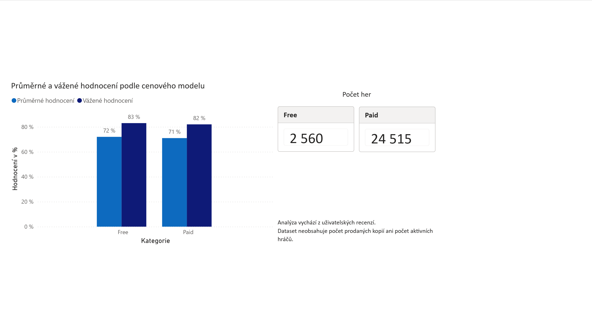
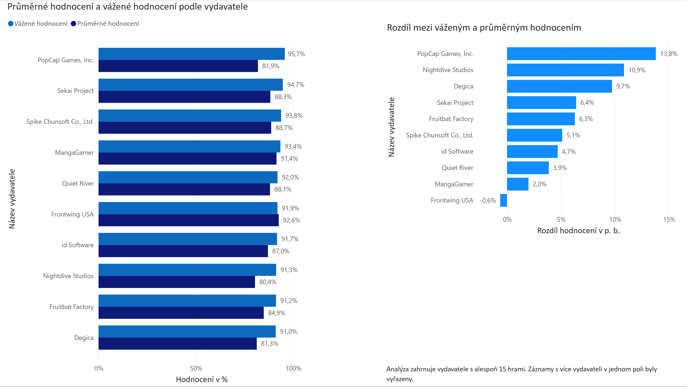
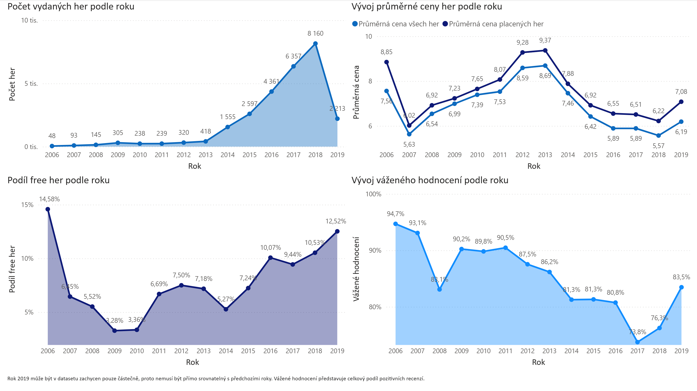
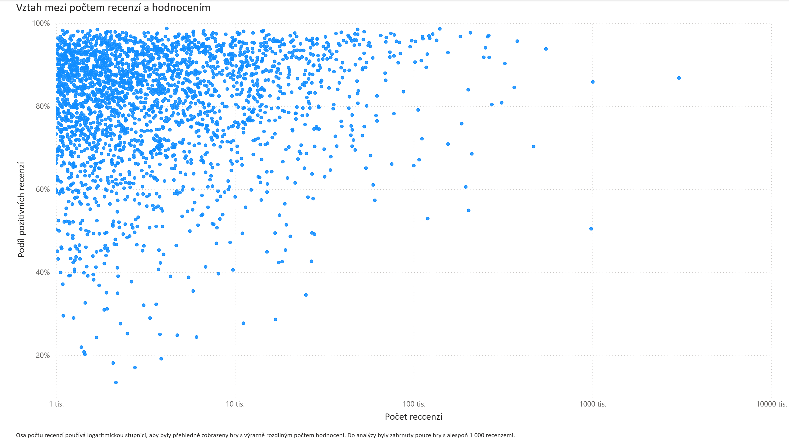

# Steam SQL Analysis
Projekt zaměřený na analýzu her dostupných na platformě Steam pomocí SQL a Power BI.

Cílem bylo procvičit práci s daty, tvorbu analytických dotazů, kontrolu výsledků a jejich následnou vizualizaci.

## Použité nástroje

- MySQL
- phpMyAdmin
- Power BI
- Excel / CSV
- GitHub

## Analytické otázky

1. Ovlivňuje cenový model hodnocení hry?
2. Kteří vydavatelé dosahují nejlepších výsledků?
3. Jak se měnil počet, cena a hodnocení her podle roku vydání?
4. Existuje souvislost mezi počtem recenzí a hodnocením hry?

## Dataset

Analýza vychází z veřejného datasetu
[Steam Store Games (Clean dataset)](https://www.kaggle.com/datasets/nikdavis/steam-store-games), který vytvořil Nik Davis.

Dataset obsahuje přibližně 27 000 her a byl sestaven z dat získaných prostřednictvím Steam Store a SteamSpy API. Data byla sesbírána přibližně v květnu 2019, proto projekt nezobrazuje současný stav nabídky na Steamu.

Cena je ve zdrojovém datasetu uvedena v britských librách (GBP). Hodnoty nebyly převáděny na jinou měnu, aby zůstaly zachovány v původní podobě datasetu.

Rok 2019 je v datasetu zachycen pouze částečně a jeho výsledky proto nemusí být přímo srovnatelné s předchozími roky.

Dataset obsahuje mimo jiné tyto údaje:

- název hry,
- datum vydání,
- vývojáře a vydavatele,
- podporované platformy,
- kategorie, žánry a uživatelské tagy,
- cenu,
- počet pozitivních a negativních recenzí,
- průměrnou a mediánovou dobu hraní,
- odhadovaný rozsah počtu vlastníků.

Analýza nepracuje s přesným počtem prodaných kopií ani s aktuálním počtem aktivních hráčů. Výsledky proto vycházejí pouze z údajů dostupných ve zdrojovém datasetu.

## Vysvětlivky použitých metrik

- **Průměrné hodnocení her** – průměr podílu pozitivních recenzí vypočítaného samostatně pro každou hru.
- **Celkový podíl pozitivních recenzí** – součet pozitivních recenzí vydělený celkovým počtem recenzí ve sledované skupině. Hry s větším počtem recenzí mají na výsledek větší vliv.
- **Free hra** – hra s cenou rovnou 0. Toto označení vychází pouze ze vstupní ceny ve zdrojovém datasetu; hra může dále obsahovat mikrotransakce, placený obsah nebo jiné formy monetizace.
- **Paid hra** – hra s cenou vyšší než 0.
- **Celkový počet recenzí** – součet pozitivních a negativních recenzí.

## 1. Free vs Paid

### Analytická otázka

Ovlivňuje cenový model hodnocení hry?

### Proč?

Steam nabízí placené(paid) i bezplatné(free) hry. Analýza proto ověřuje, zda má cenový model výrazný vliv na spokojenost hráčů, nebo zda hodnocení závisí především na kvalitě samotné hry.

### Cíl

Porovnat uživatelské hodnocení Free a Paid her.

### Metodika

Hry byly rozděleny podle ceny na:

- **Free:** `price = 0`
- **Paid:** `price > 0`

Analýza vychází z uživatelských hodnocení `positive_ratings` a `negative_ratings`, nikoliv z počtu prodaných kopií. Zahrnuty byly pouze hry, které měly alespoň jednu uživatelskou recenzi.

Porovnány byly dvě metriky:

- průměrné hodnocení jednotlivých her,
- celkový podíl pozitivních recenzí v dané skupině.

### Výsledky

| Cenový model | Počet her | Průměrné hodnocení | Celkový podíl pozitivních recenzí |
|---|---:|---:|---:|
| Free | 2 560 | 72 % | 83 % |
| Paid | 24 515 | 71 % | 82 % |

### Klíčové zjištění

Cenový model nemá podle analyzovaných dat výrazný vliv na uživatelské hodnocení her. Free i Paid hry dosahují velmi podobných výsledků v obou použitých metrikách.

Přestože je placených her výrazně více, jejich hodnocení je téměř shodné s bezplatnými tituly. Samotná vstupní cena hry se proto v tomto datasetu neukazuje jako významný faktor spokojenosti hráčů.

### Vizualizace

### SQL dotaz

[Zobrazit SQL dotaz](sql/01_free_vs_paid.sql)

### Omezení

Analýza pracuje pouze s uživateli, kteří hru ohodnotili. Dataset neobsahuje přesný počet prodaných kopií ani počet aktivních hráčů.

## 2. Publisher Analysis

### Analytická otázka

Kteří vydavatelé dosahují nejlepších výsledků z pohledu uživatelského hodnocení?

### Proč?

Vydavatelé vydávají rozdílný počet her a jejich úspěšnost se může výrazně lišit. Analýza proto sleduje, kteří vydavatelé dosahují nejlepších výsledků z pohledu uživatelského hodnocení.

### Cíl

Porovnat vydavatele podle průměrného hodnocení jejich her a podle celkového podílu pozitivních recenzí.

### Metodika

Do analýzy byli zahrnuti pouze vydavatelé s alespoň 15 hrami.

Vyřazeny byly:

- hry bez uživatelských recenzí,
- záznamy, u kterých bylo v poli vydavatele uvedeno více než jeden vydavatel.

Porovnány byly dvě metriky:

- průměrné hodnocení jednotlivých her,
- celkový podíl pozitivních recenzí vydavatele.

### Poznatek

Samotný aritmetický průměr zachází se všemi hrami stejně bez ohledu na počet recenzí. Celkový podíl pozitivních recenzí naopak dává větší vliv titulům s vyšším počtem hodnocení.

Porovnání obou metrik proto ukazuje, zda výsledky vydavatele ovlivňují především jeho více hodnocené tituly.

### Klíčové zjištění

U většiny TOP 10 vydavatelů je celkový podíl pozitivních recenzí vyšší než průměrné hodnocení jednotlivých her.

Největší rozdíl vykazují PopCap Games, Nightdive Studios a Degica, což naznačuje, že jejich více hodnocené tituly dosahují lepších výsledků než méně hodnocené hry.

Frontwing USA je jediným vydavatelem v TOP 10, u kterého je celkový podíl pozitivních recenzí mírně nižší.

### Vizualizace

### SQL dotaz

[Zobrazit SQL dotaz](sql/02_publisher_analysis.sql)

## 3. Vývoj her podle roku vydání

### Analytická otázka

Jak se měnil počet, cena a hodnocení her podle roku vydání?

### Proč?

Nabídka her na Steamu se v jednotlivých letech měnila z pohledu počtu vydaných titulů, jejich ceny i hodnocení hráčů. Analýza proto sleduje, jak se tyto ukazatele vyvíjely podle roku vydání.

### Cíl

Porovnat počet vydaných her, jejich průměrnou cenu, podíl Free her a celkový podíl pozitivních recenzí v jednotlivých letech.

### Metodika

Analýza pracuje s obdobím 2006–2019.

Sledovány byly tyto ukazatele:

- počet vydaných her,
- průměrná cena všech her,
- průměrná cena pouze placených her,
- podíl Free her,
- celkový podíl pozitivních recenzí v daném roce.

Počty her, ceny a podíl Free her byly počítány ze všech titulů. Hodnocení bylo vypočítáno pouze z her, které měly alespoň jednu uživatelskou recenzi.

Cena je uvedena v britských librách (GBP), stejně jako ve zdrojovém datasetu.

### Poznatek

Průměrná cena byla sledována včetně i bez Free her, aby bylo možné ukázat, jak bezplatné tituly ovlivňují celkový cenový průměr.

Celkový podíl pozitivních recenzí dává větší vliv hrám s vyšším počtem hodnocení a lépe tak zachycuje celkové přijetí her vydaných v daném roce.

### Klíčové zjištění

Počet vydaných her rostl do roku 2013 pouze pozvolna, ale od roku 2014 začal prudce stoupat. Nejvyšší počet titulů byl v datasetu zaznamenán v roce 2018, kdy vyšlo 8 160 her.

Průměrná cena placených her dosáhla nejvyšších hodnot v letech 2012 a 2013, přibližně 9,3 GBP. V následujících letech postupně klesala. Průměrná cena všech her byla po celé období nižší, protože ji snižovaly bezplatné tituly.

Podíl Free her po minimu kolem let 2009–2010 postupně rostl a v roce 2019 dosáhl přibližně 12,5 %.

Celkový podíl pozitivních recenzí vykazoval v průběhu období převážně klesající trend. Z přibližně 95 % v roce 2006 poklesl až na přibližně 74 % v roce 2017, poté opět vzrostl.

### Vizualizace

### SQL dotaz

[Zobrazit SQL dotaz](sql/03_development_by_year.sql)

### Omezení

Rok 2019 je v datasetu zachycen pouze částečně, proto jeho výsledky nemusí být přímo srovnatelné s předchozími roky.

## 4. Počet recenzí vs. hodnocení

### Analytická otázka

Existuje souvislost mezi počtem uživatelských recenzí a výsledným hodnocením hry?

### Proč?

Vysoké hodnocení může být založeno pouze na malém počtu recenzí, zatímco známější hry mají hodnocení podložené výrazně větším množstvím uživatelů. Je proto vhodné sledovat hodnocení společně s počtem recenzí.

### Cíl

Zjistit, zda je z rozložení dat patrná souvislost mezi počtem uživatelských recenzí a hodnocením hry.

### Metodika

Celkový počet recenzí byl vypočítán jako součet pozitivních a negativních hodnocení.

Hodnocení hry bylo vypočítáno jako podíl pozitivních recenzí z celkového počtu recenzí.

Do analýzy byly zahrnuty pouze hry s alespoň 1 000 uživatelskými recenzemi, aby výsledky nebyly výrazně ovlivněny tituly s malým počtem hodnocení. Po aplikování filtru zůstalo v analýze 2 578 her.

Pro zobrazení vztahu mezi počtem recenzí a hodnocením byl použit bodový graf:

- osa X představuje celkový počet recenzí,
- osa Y představuje podíl pozitivních recenzí,
- každý bod představuje jednu hru.

Osa X používá logaritmickou stupnici, protože počet recenzí se mezi jednotlivými hrami výrazně liší.

### Poznatek

Většina her s vyšším počtem recenzí se pohybuje ve vyšších hodnotách hodnocení. Současně ale existují i velmi známé hry s vysokým počtem recenzí a pouze průměrným nebo nižším podílem pozitivních hodnocení.

### Klíčové zjištění

Z grafu není patrná jednoznačná přímá závislost mezi počtem recenzí a hodnocením hry. I tituly s velmi vysokým počtem recenzí mohou dosahovat jak vysokého, tak pouze průměrného hodnocení.

### Vizualizace

### SQL dotaz

[Zobrazit SQL dotaz](sql/04_reviews_vs_rating.sql)

### Omezení

Z grafu lze pozorovat rozložení a možný vztah mezi oběma veličinami, ale nebyl vypočítán korelační koeficient. Výsledek proto představuje vizuální interpretaci, nikoliv přesné statistické měření závislosti.

## Celkové závěry

Analýza ukázala, že samotná vstupní cena hry nemá v tomto datasetu výrazný vliv na uživatelské hodnocení. Free i Paid hry dosahují velmi podobných výsledků.

U vydavatelů se ukázalo, že celkový podíl pozitivních recenzí může být vyšší než průměrné hodnocení jednotlivých her. To znamená, že výsledky některých vydavatelů táhnou především jejich více hodnocené tituly.

Počet vydaných her začal od roku 2014 výrazně růst a nejvyšší hodnoty dosáhl v roce 2018. Současně se v průběhu let měnila průměrná cena, podíl Free her i celkové hodnocení.

Vztah mezi počtem recenzí a hodnocením nebyl z grafu jednoznačný. Hry s vysokým počtem recenzí mohou dosahovat jak vysokého, tak pouze průměrného hodnocení.

Celkově projekt ukazuje, že při hodnocení her nestačí sledovat pouze jednu metriku. Počet recenzí, cena, rok vydání i způsob agregace hodnocení mohou významně ovlivnit výslednou interpretaci.

## Možná budoucí rozšíření

- výpočet korelačního koeficientu mezi počtem recenzí a hodnocením,
- porovnání vývojářů a vydavatelů,
- detailnější analýza cenových pásem,
- získání aktuálnějších dat a porovnání výsledků s původním datasetem z roku 2019,
- sledování změn v počtu her, cenách, podílu Free titulů a hodnocení mezi oběma obdobími,
- doplnění dalších vizualizací nebo interaktivního dashboardu.